# Telegram Translator Bot

A simple and effective Telegram bot for real-time message translation using OpenAI models.

## How It Works

The diagram below illustrates the main workflow of the bot: from receiving a message to sending the translation using an LLM.

```mermaid
graph TD;
    A[👤 Пользователь] -- "Отправляет сообщение" --> B(🤖 TG-Bot);
    B -- "Получает сообщение" --> C["🧠 Определение языка (LLM)"];
    C -- "Язык определён" --> D["🧠 Перевод текста (LLM)"];
    D -- "Текст переведён" --> E(🤖 TG-Bot);
    E -- "Отправляет перевод" --> A;
```



## Features

*   **OpenAI-Powered Translation**: Uses OpenAI models for accurate and contextual translation.
*   **Automatic Language Detection**: The bot automatically detects the language of the incoming message using an LLM.
*   **Language Selection**: The user can choose the target language for translation.
*   **Ease of Use**: Just send the bot a text, and it will translate it.

## 🛠️ Installation and Launch

To run the bot locally, follow these steps:

1.  **Clone the repository:**
    ```bash
    git clone https://github.com/Zegor88/Translator_TG_bot.git
    cd Translator_TG_bot
    ```

2.  **Install dependencies:**
    > [!NOTE]
    > Make sure you have Python 3.8+ and pip installed.

    Create and activate a virtual environment (recommended):
    ```bash
    python -m venv venv
    source venv/bin/activate # for macOS/Linux
    # venv\Scripts\activate  # for Windows
    ```

    Install the required libraries:
    ```bash
    pip install python-telegram-bot openai python-dotenv
    ```

3.  **Set up environment variables:**
    Create a `.env` file in the root directory of the project and add your bot token and OpenAI API key:
    ```
    TG_TOKEN="YOUR_API_TOKEN_HERE"
    OPENAI_API_KEY="YOUR_OPENAI_API_KEY_HERE"
    ```
    - `TG_TOKEN`: You can get a token from [@BotFather](https://t.me/BotFather) on Telegram.
    - `OPENAI_API_KEY`: You can get an API key from the [OpenAI platform](https://platform.openai.com/api-keys).

4.  **Run the bot:**
    ```bash
    python Translator_TG_bot/tg_translator_bot.py
    ```

## Usage

1.  Find your bot on Telegram by its username.
2.  Press "Start" or send the `/start` command.
3.  Use the `/language` command to select the language your messages will be translated into.
4.  Send any text message to the bot.
5.  The bot will reply with the translated text.

> [!TIP]
> You can improve this bot by adding GPT model selection or other translation settings. 